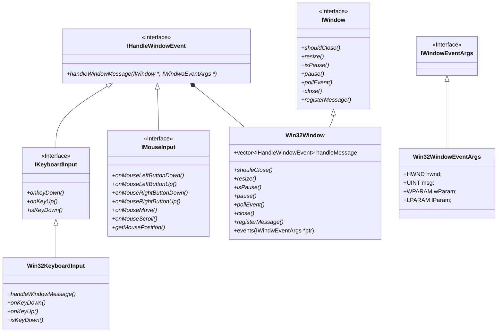

# win32 input

```mermaid
classDiagram

class IHandleWindowEvent {
	<<Interface>>
	+handleWindowMessage(IWindow *, IWindwoEventArgs *)*
}

class IWindow {
	<<Interface>>
	+shouldClose()*
	+resize()*
	+isPause()*
	+pause()*
	+pollEvent()*
	+close()*
	+registerMessage()*
}

class IWindowEventArgs {
	<<Interface>>
}

IHandleWindowEvent <|-- IKeyboardInput
class IKeyboardInput {
	<<Interface>>
	+onkeyDown()*
	+onKeyUp()*
	+isKeyDown()*
}

IHandleWindowEvent <|-- IMouseInput
class IMouseInput {
	<<Interface>>
	+onMouseLeftButtonDown()*
	+onMouseLeftButtonUp()*
	+onMouseRightButtonDown()*
	+onMouseRightButtonUp()*
	+onMouseMove()*
	+onMouseScroll()*
	+getMousePosition()*
}

IWindow <|-- Win32Window
IHandleWindowEvent *-- Win32Window

IKeyboardInput <|-- Win32KeyboardInput
class Win32KeyboardInput {
	+handleWindowMessage()*
	+onKeyDown()*
	+onKeyUp()*
	+isKeyDown()*
}

class Win32Window {
	+vector~IHandleWindowEvent~	handleMessage
	+shouleClose()*
	+resize()*
	+isPause()*
	+pause()*
	+pollEvent()*
	+close()*
	+registerMessage()*
	+events(IWindwEventArgs *ptr)
}

IWindowEventArgs <|-- Win32WindowEventArgs
class Win32WindowEventArgs {
	+HWND	hwnd;
	+UINT	msg;
	+WPARAM wParam;
	+LPARAM lParam;
}
```

